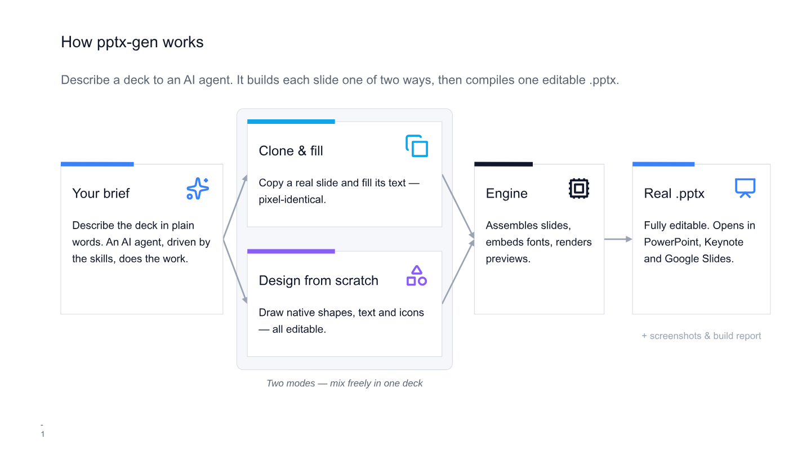

# pptx-gen

Build editable PowerPoint decks with your coding agents



<sup>This diagram is itself a slide generated by pptx-gen — built entirely from
native shapes, so it doubles as a live demo of the "design from scratch" mode.
See [`examples/how-it-works/`](examples/how-it-works).</sup>

pptx-gen gives you two modes that mix freely in one deck:

- **Clone and fill.** Ingest slides from a `.pptx`, keep each slide's exact visual
  structure, fill the text, and apply small edits. It copies the original slide
  instead of redrawing it, so fonts, shapes, arrows, images, and layout stay
  pixel-identical to the source.
- **Design from scratch.** Draw slides from native shapes, text, lines, and vector
  icons, guided by a customizable [design system](design.md). No template needed.
  Everything stays editable and recolorable in PowerPoint and Google Slides.

Either way the output is a real `.pptx` that opens cleanly in PowerPoint, Keynote,
and Google Slides.

It ships with:

- a small TypeScript engine (no build step, run with [tsx](https://tsx.is)),
- a CLI to ingest templates and build decks,
- a customizable [design system](design.md),
- the [Lucide](https://lucide.dev) icon set (1,900+ icons),
- two example templates, and
- [skills](#skills) that let an AI agent (Claude Code, Codex, …) drive the whole
  workflow.

**How you use it.** The primary interface is the [skills](#skills). You describe
the deck to an AI coding agent (Claude Code, Codex, …), and it does everything for
you: choosing templates or designing slides, writing the build script, running the
CLI, reviewing the screenshots, and handing back the `.pptx`. You can also drive
the CLI and the API directly — both are documented below — but you never have to.

---

## Two ways to build a deck

**Clone and fill** is for slides that already exist. Rebuilding a complex slide
from code is brittle: it loses circles, dashed connectors, arrowheads, exact
title sizes, and embedded fonts. pptx-gen instead copies the original slide's XML
and changes only what you ask it to. The template slide is the source of truth;
you can still add, move, delete, and restyle elements, but those are explicit
operations, not a redraw. Reach for this when you have a branded deck to reuse.

**Design from scratch** is for slides that do not exist yet. You draw them from
native shapes, text, and icons, and the [design system](design.md) supplies the
visual language: the palette, the fonts, the slide grid, and conventions like the
header and footer. Because everything is a native
object, the result stays fully editable. Reach for this for diagrams, flows, code
panels, tables, timelines, covers, and any layout you would otherwise have to
hand-build. The [`design.md`](design.md) file is the single place that steers how
these slides look, so changing it restyles every scratch-built slide at once.

Most real decks use both: cloned slides where a template fits, scratch-built
slides where none does.

---

## Requirements

- **Node.js 20 or newer.** No compile step: the engine runs `.ts` directly via
  `tsx`.
- **Nothing else to produce a `.pptx`.** Building a deck needs no external
  binaries.
- **LibreOffice (optional).** Only used to render screenshots for review. If it
  is not installed, screenshots are skipped and the deck is still built. Install
  it from [libreoffice.org](https://www.libreoffice.org) to enable them.

## Install

```bash
git clone <your-fork-url> pptx-gen
cd pptx-gen
npm install

# hand the skills to your coding agent (Claude Code, Codex, …)
npx skills add alfonsograziano/pptx-gen
```

That last command uses [skills.sh](https://skills.sh) to install the four skills
into your agent's skills directory (for Claude Code, `.claude/skills/`), so it
discovers them automatically. Prefer to wire them in by hand? See [Skills](#skills).

## Quick start

You never write build code. Once the skills are installed, you just talk to your
coding agent from inside the repo, in plain language. Each kind of request maps to
one of four skills, and the agent runs the whole workflow — writing the script,
running the CLI, reviewing the rendered screenshots, fixing issues, and handing
back the files.

### Build a deck — `pptx-deck`

The main event. Describe the deck you want and the agent produces a finished,
editable `.pptx`.

> Build a 4-slide deck introducing our new payments API to a technical audience.
> Open with a title slide, then the problem, then how it works, then a call to
> action. Keep it factual.

The agent reads [`design.md`](design.md) for the visual language, picks templates
where one fits or designs slides from scratch where none does, writes a build
script (`projects/payments-api/build.ts`), builds it, inspects the screenshots and
build report, and hands back `projects/payments-api/output/deck.pptx`. To change
anything, just say so — *"make slide 3 a two-column layout and cut the jargon"* —
and it edits the script and rebuilds.

### Reuse your own slides — `ingest-slide-templates`

Have a branded deck already? Point the agent at it and it imports slides into the
template library so future decks can clone them pixel-for-pixel.

> Import slides 3, 5 and 8 from `brand-deck.pptx` as reusable templates.

Each imported slide becomes a folder under [`templates/`](templates) with its
editable fields detected automatically, ready to fill.

### Describe a template — `draft-slide-template-description`

Templates work best when the agent knows when to use each one. This skill writes a
template's `description.md` from its screenshot and fields, so it gets picked
correctly later.

> Document what the two-column template is for and when to use it.

### Match your brand — `customize-design`

Retarget the whole design system — colours, fonts, layout — in one shot. Every
scratch-built slide restyles at once.

> Make decks match our brand: navy #0B1F3A background, a coral accent, Poppins font.

The agent edits [`src/design.ts`](src/design.ts) and [`design.md`](design.md)
together so the code and its documentation stay in sync.

## Concepts

### Templates

A template is a folder under `templates/`. Each holds one slide:

```text
templates/title-cover/
  template.pptx       # a real one-slide PPTX (the source of truth)
  template.yml        # metadata: id, fonts, tags, variables
  fields.yml          # the editable text fields and their ids
  description.md      # what the slide is and when to use it
  screenshots/        # slide-01.png, if rendered
```

The template id is the folder name. To see what is available:

```bash
npm run show-all-templates          # builds a preview folder of screenshots
find templates -maxdepth 2 -name description.md | sort
```

### Fields and variables

Every text box in a template is an editable **field** with a stable id, listed in
`fields.yml`. You fill fields by id through `variables`:

```ts
deck.addSlideFromTemplate({
  templateName: "content-lead-bullets",
  variables: {
    "section-header": "Why it works",                     // plain string
    "a-lead-statement-that-frames-the-thr": md("**Bold** lead."), // markdown
  },
});
```

- **Plain strings** replace the text and keep the original style.
- **`md(...)`** accepts markdown; it is converted to styled plain text (bold,
  italic, links, bullets flatten into paragraphs; mixed runs are not yet built).
- A newline in a value becomes a new paragraph, inheriting the box's paragraph
  style. That is how you fill a bullet list held in a single text box.
- Filling a field that does not exist is a warning; an invalid override target is
  a hard failure.

### Overrides

When a template almost fits, apply explicit edits:

```ts
deck.addSlideFromTemplate({
  templateName: "content-lead-bullets",
  variables: { "section-header": "Roadmap" },
  overrides: [
    { op: "hide", target: "a-lead-statement-that-frames-the-thr" },
    { op: "move", target: "section-header", x: 0.75, y: 1.1 },
    { op: "resize", target: "section-header", w: 7.5, h: 0.8 },
    { op: "styleText", target: "section-header", fontSize: 16, color: "3B82F6" },
    { op: "addText", id: "note", text: md("A **note**."), x: 0.75, y: 4.3, w: 4, h: 0.4 },
    { op: "addIcon", id: "flag", icon: "flag.svg", x: 8.8, y: 0.9, w: 0.35, h: 0.35, color: "3B82F6" },
    { op: "replaceImage", target: "some-image-field", path: "inputs/photo.png" },
  ],
});
```

Available operations: `delete`, `hide`, `move`, `resize`, `styleText`,
`addText`, `addSvg`, `addIcon`, `replaceImage`. Targets are field ids, shape ids,
or shape names. Use overrides sparingly; if a slide needs many, pick a different
template or build a custom slide.

### Slides from scratch (custom slides)

A `CustomSlide` draws a slide from native shapes, text, lines, and vector icons.
This is a first-class way to build a deck, not just a fallback: covers, section
breaks, diagrams, flows, code panels, tables, and timelines are all built this
way. Add them to a deck alongside cloned slides in any order:

```ts
deck.addCustomSlide(new CustomSlide({
  name: "callout",
  background: "light",
  draw({ slide, helpers }) {
    helpers.addHeader(slide, "One clear idea");    // sentence-case header
    slide.addText("The statement.", { x: LAYOUT.LM, y: 1, w: LAYOUT.CW, h: 1, fontSize: 24, color: C.ink });
    helpers.addFooter(slide, 2);                   // page number + optional logo
  },
}));
```

The `draw` callback receives helpers (`addHeader`, `addFooter`, `addCard`,
`addArrow`, `addConnector`, `addIcon`, `addVectorIcon`, `addCodePanel`, …) and the
design tokens (`C`, `FONTS`, `LAYOUT`). Build everything from native objects so it
stays editable and recolorable in PowerPoint and Google Slides.
[`custom-template-instructions.md`](custom-template-instructions.md) has the full
guide and ten worked layouts.

### The design system: visual guidance for scratch-built slides

Colours, fonts, the slide grid, and optional logos live in one place:
[`src/design.ts`](src/design.ts), documented in [`design.md`](design.md). This is
the visual language every scratch-built slide follows: the helpers and design
tokens read straight from it, so a card's accent
bar, the body font, and the footer all come from the design. **Change `design.ts`
and every scratch-built slide restyles at once** — no need to touch each slide.

The design steers custom slides and any elements the engine adds (added text,
icons). It does not repaint the baked-in pixels of a cloned template: those keep
the exact look they were imported with. To retarget the design to your brand, edit
`design.ts` and `design.md` together (or run the `customize-design` skill), then
optionally `npm run install-fonts`.

### Icons

`assets/icons/` holds the Lucide set. Reference an icon by file name in an
`addIcon` override or `helpers.addIcon(...)`. Icons are emitted as native
custom-geometry shapes, so they recolor and edit like any other shape.

---

## Importing your own templates

Export the slides you want as a `.pptx` (in Google Slides:
File → Download → Microsoft PowerPoint). Then ingest:

```bash
# one slide from a deck
npm run cli -- ingest --source "deck.pptx" --template two-column --slide 3

# every slide as its own template
npm run cli -- ingest --source "deck.pptx" --template mydeck --split
```

Each ingest creates a template folder with `template.pptx`, `template.yml`,
`fields.yml`, a `description.md` stub, and a screenshot (if LibreOffice is
installed). Fill in the description by hand, or let the
`draft-slide-template-description` skill write it from the screenshot.

Fonts used by a template are embedded in its `template.pptx`, so decks built from
it render correctly everywhere, even on a machine that lacks the font.

---

## CLI

These are the commands the skills run for you. You can also run them directly.

```bash
npm run cli -- ingest --source <file.pptx> --template <name> [--slide <n> | --split]
npm run cli -- build  --script <project>/build.ts
npm run cli -- validate --pptx <file.pptx>
```

Other scripts:

```bash
npm test                 # run the test suite
npm run build            # typecheck (tsc --noEmit)
npm run install-fonts    # install the design fonts locally (optional)
npm run show-all-templates
npm run self-validate    # end-to-end: ingest, build, and check a deck
```

---

## Skills

The [`skills/`](skills) folder is the main way to use pptx-gen. Each skill is a
`SKILL.md` that teaches an AI coding agent (Claude Code, Codex, and similar) the
whole workflow, including the exact CLI commands to run, so the agent drives the
tool end to end from a plain-language request.

- **`pptx-deck`** — turn a brief or notes into a finished deck: read the design,
  choose templates or design slides from scratch, write `build.ts`, run
  `npm run cli -- build`, review screenshots, and return the `.pptx`.
- **`ingest-slide-templates`** — import slides from a `.pptx` into the library
  (`npm run cli -- ingest`) and document each one.
- **`draft-slide-template-description`** — write a template's `description.md` from
  its screenshot or fields.
- **`customize-design`** — retarget the design system (`src/design.ts` +
  `design.md`) to a brand.

### Wire them into your agent

The quickest way is the [`npx skills add`](#install) command from the install step
above, via [skills.sh](https://skills.sh) — it drops the skills into your agent's
skills directory automatically.

Prefer to link them yourself? Claude Code discovers skills under
`.claude/skills/`, so you can symlink this repo's skills in once:

```bash
mkdir -p ~/.claude/skills
ln -s "$(pwd)/skills/"* ~/.claude/skills/
```

Other agents: point their skills/instructions directory at [`skills/`](skills) the
same way, or open a `SKILL.md` and follow it by hand — they are plain Markdown.

---
## License

MIT for the code (see [LICENSE](LICENSE)). The bundled icons are Lucide, under
the ISC license (see [`assets/icons/LICENSE`](assets/icons/LICENSE)).
