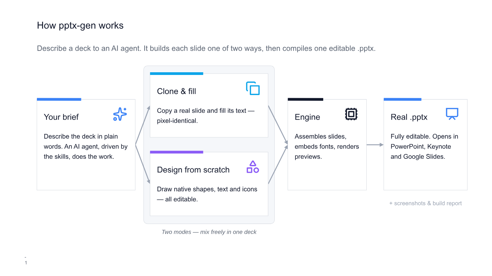
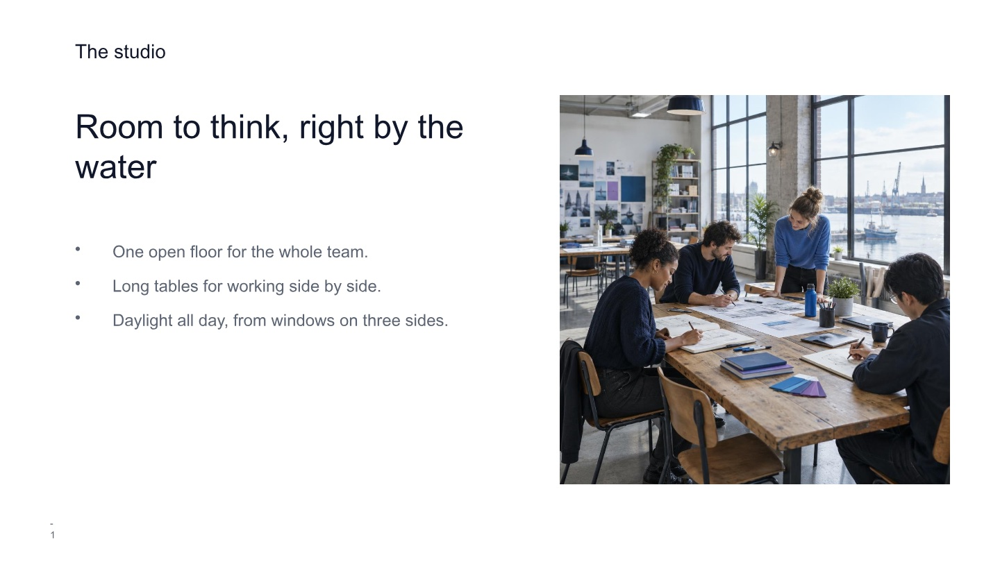

# pptx-gen

Build editable PowerPoint decks with your coding agents



<sup>This diagram is itself a slide generated by pptx-gen — built entirely from
native shapes, so it doubles as a live demo of the "design from scratch" mode.
See [`examples/workspace/projects/how-it-works/`](examples/workspace/projects/how-it-works).</sup>

pptx-gen gives you two modes that mix freely in one deck:

- **Clone and fill.** Ingest slides from a `.pptx`, keep each slide's exact visual
  structure, fill the text, and apply small edits. It copies the original slide
  instead of redrawing it, so fonts, shapes, arrows, images, and layout stay
  pixel-identical to the source.
- **Design from scratch.** Draw slides from native shapes, text, lines, and vector
  icons, guided by a customizable [design system](starter/design.md). No template needed.
  Everything stays editable and recolorable in PowerPoint and Google Slides.

Either way the output is a real `.pptx` that opens cleanly in PowerPoint, Keynote,
and Google Slides.

It ships with:

- a small TypeScript engine (no build step, run with [tsx](https://tsx.is)),
- a CLI to ingest templates and build decks,
- a customizable [design system](starter/design.md),
- the [Lucide](https://lucide.dev) icon set (1,900+ icons),
- two example templates, and
- [skills](#skills) that let an AI agent (Claude Code, Codex, …) drive the whole
  workflow.

**How you use it.** The primary interface is the [skills](#skills). You describe
the deck to an AI coding agent (Claude Code, Codex, …), and it does everything for
you: choosing templates or designing slides, writing the build script, running the
CLI, reviewing the screenshots, and handing back the `.pptx`. You can also drive
the CLI and the API directly — both are documented below — but you never have to.

---

## Two ways to build a deck

**Clone and fill** is for slides that already exist. Rebuilding a complex slide
from code is brittle: it loses circles, dashed connectors, arrowheads, exact
title sizes, and embedded fonts. pptx-gen instead copies the original slide's XML
and changes only what you ask it to. The template slide is the source of truth;
you can still add, move, delete, and restyle elements, but those are explicit
operations, not a redraw. Reach for this when you have a branded deck to reuse.

**Design from scratch** is for slides that do not exist yet. You draw them from
native shapes, text, and icons, and the [design system](starter/design.md) supplies the
visual language: the palette, the fonts, the slide grid, and conventions like the
header and footer. Because everything is a native
object, the result stays fully editable. Reach for this for diagrams, flows, code
panels, tables, timelines, covers, and any layout you would otherwise have to
hand-build. Your workspace's `design.yml` is the single place that steers how
these slides look, so changing it restyles every scratch-built slide at once.

Most real decks use both: cloned slides where a template fits, scratch-built
slides where none does.

---

## Requirements

- **Node.js 20 or newer.** No compile step: the engine runs `.ts` directly via
  `tsx`. `.nvmrc` tracks the current LTS, so `nvm use` (or fnm, or mise) picks a
  supported runtime up in a fresh clone.
- **Nothing else to produce a `.pptx`.** Building a deck needs no external
  binaries.
- **LibreOffice (optional).** Only used to render screenshots for review. If it
  is not installed, screenshots are skipped and the deck is still built. Install
  it from [libreoffice.org](https://www.libreoffice.org) to enable them.
- **Google Chrome (optional).** Only needed by decks that use [figures](#figures).
  Without it, each figure becomes a captioned grey placeholder and the deck is
  still built. Chromium, Edge, and Brave work too; `CHROME_PATH` names a specific
  binary.
- **An OpenAI API key (optional).** Only needed to [generate images](#ai-images-optional)
  with `pptx-gen images`. Without it, each declared image becomes a captioned
  grey placeholder and the deck is still built.

## Install

Two things live in two places: the **engine** (this repo) and your **workspace**
(your brand, templates and decks). Keeping them apart is the point — you can
update the engine without carrying your decks along, or touching them at all.

```bash
git clone <your-fork-url> pptx-gen
cd pptx-gen
nvm use          # optional: matches .nvmrc
npm ci           # installs exactly what package-lock.json pins
npm link
```

`npm link` puts `pptx-gen` on your PATH while still pointing at this clone, so a
later pull updates the command in place. Then create a workspace, anywhere you
like, and hand the skills to your agent:

```bash
pptx-gen init ~/decks
npx skills add alfonsograziano/pptx-gen
```

`init` creates this, and nothing in it depends on where the engine lives:

```text
~/decks/
  pptx-gen.config.yml   which folders hold what
  design.yml            your brand: colours, fonts, grid, logo names
  design.md             the same, written for humans and agents
  customize.md          your house rules, read by every skill before it acts
  templates/            your slide library (starter templates copied in)
  projects/<deck-id>/   one folder per deck
  assets/               your logos, and any icons you add
```

Updating the engine is then just a pull in the clone. Your workspace is
untouched, and a `design.yml` written before a new token existed keeps working,
because anything it omits falls back to the engine default.

Want a separate brand per client? Run `init` again somewhere else. Commands find
the workspace by walking up from wherever you are, so `cd ~/clients/acme && pptx-gen …`
just works; `--workspace <dir>` or `PPTX_GEN_WORKSPACE` override it.

The `npx skills add` step uses [skills.sh](https://skills.sh) to install the four
skills into your agent's skills directory (for Claude Code, `.claude/skills/`), so
it discovers them automatically. Prefer to wire them in by hand? See [Skills](#skills).

## Quick start

You never write build code. Once the skills are installed, you just talk to your
coding agent from inside your workspace, in plain language. Each kind of request
maps to one of four skills, and the agent runs the whole workflow — writing the
script, running the CLI, reviewing the rendered screenshots, fixing issues, and
handing back the files.

### Build a deck — `pptx-deck`

The main event. Describe the deck you want and the agent produces a finished,
editable `.pptx`.

> Build a 4-slide deck introducing our new payments API to a technical audience.
> Open with a title slide, then the problem, then how it works, then a call to
> action. Keep it factual. Give me 3 variants of the "how it works" slide so I
> can pick a layout.

The agent reads your workspace's `design.md` for the visual language, picks
templates where one fits or designs slides from scratch where none does, writes a
build script (`~/decks/projects/payments-api/build.ts`), builds it, inspects the
screenshots and build report, and hands back
`~/decks/projects/payments-api/output/deck.pptx`. To change anything, just say so
— *"make slide 3 a two-column layout and cut the jargon"* — and it edits the
script and rebuilds.

### Reuse your own slides — `ingest-slide-templates`

Have a branded deck already? Point the agent at it and it imports slides into the
template library so future decks can clone them pixel-for-pixel.

> Import slides 3, 5 and 8 from `brand-deck.pptx` as reusable templates.

Each imported slide becomes a folder under your workspace's `templates/` with its
editable fields detected automatically, ready to fill.

### Describe a template — `draft-slide-template-description`

Templates work best when the agent knows when to use each one. This skill writes a
template's `description.md` from its screenshot and fields, so it gets picked
correctly later.

> Document what the two-column template is for and when to use it.

### Match your brand — `customize-design`

Retarget the whole design system — colours, fonts, layout — in one shot. Every
scratch-built slide restyles at once.

> Make decks match our brand: navy #0B1F3A background, a coral accent, Poppins font.

The agent edits your workspace's `design.yml` and `design.md` together so the
values and their documentation stay in sync. Both are yours — an engine update
never overwrites them.

## Concepts

### Templates

A template is a folder under your workspace's `templates/`. Each holds one slide:

```text
<workspace>/templates/title-cover/
  template.pptx       # a real one-slide PPTX (the source of truth)
  template.yml        # metadata: id, fonts, tags, variables
  fields.yml          # the editable text fields and their ids
  description.md      # what the slide is and when to use it
  screenshots/        # slide-01.png, if rendered
```

The template id is the folder name. To see what is available:

```bash
pptx-gen workspace                  # where everything lives
npm run show-all-templates          # builds a preview folder of screenshots
find "$(pptx-gen workspace --json | jq -r .templates)" -maxdepth 2 -name description.md | sort
```

### Fields and variables

Every text box in a template is an editable **field** with a stable id, listed in
`fields.yml`. You fill fields by id through `variables`:

```ts
deck.addSlideFromTemplate({
  templateName: "content-lead-bullets",
  variables: {
    "section-header": "Why it works",                     // plain string
    "a-lead-statement-that-frames-the-thr": md("**Bold** lead."), // markdown
  },
});
```

- **Plain strings** replace the text and keep the original style.
- **`md(...)`** accepts markdown; it is converted to styled plain text (bold,
  italic, links, bullets flatten into paragraphs; mixed runs are not yet built).
- A newline in a value becomes a new paragraph, inheriting the box's paragraph
  style. That is how you fill a bullet list held in a single text box.
- Filling a field that does not exist is a warning; an invalid override target is
  a hard failure.

### Overrides

When a template almost fits, apply explicit edits:

```ts
deck.addSlideFromTemplate({
  templateName: "content-lead-bullets",
  variables: { "section-header": "Roadmap" },
  overrides: [
    { op: "hide", target: "a-lead-statement-that-frames-the-thr" },
    { op: "move", target: "section-header", x: 0.75, y: 1.1 },
    { op: "resize", target: "section-header", w: 7.5, h: 0.8 },
    { op: "styleText", target: "section-header", fontSize: 16, color: "3B82F6" },
    { op: "addText", id: "note", text: md("A **note**."), x: 0.75, y: 4.3, w: 4, h: 0.4 },
    { op: "addIcon", id: "flag", icon: "flag.svg", x: 8.8, y: 0.9, w: 0.35, h: 0.35, color: "3B82F6" },
    { op: "replaceImage", target: "some-image-field", path: "inputs/photo.png" },
  ],
});
```

Available operations: `delete`, `hide`, `move`, `resize`, `styleText`,
`addText`, `addSvg`, `addIcon`, `addImage`, `addFigure`, `replaceImage`,
`replaceFigure`.

### Slides from scratch (custom slides)

A `CustomSlide` draws a slide from native shapes, text, lines, and vector icons.
This is a first-class way to build a deck, not just a fallback: covers, section
breaks, diagrams, flows, code panels, tables, and timelines are all built this
way. Add them to a deck alongside cloned slides in any order:

```ts
deck.addCustomSlide(new CustomSlide({
  name: "callout",
  background: "light",
  draw({ slide, helpers }) {
    helpers.addHeader(slide, "One clear idea");    // sentence-case header
    slide.addText("The statement.", { x: LAYOUT.LM, y: 1, w: LAYOUT.CW, h: 1, fontSize: 24, color: C.ink });
    helpers.addFooter(slide);                      // page number + optional logo
  },
}));
```

The `draw` callback receives helpers (`addHeader`, `addFooter`, `addCard`,
`addArrow`, `addConnector`, `addIcon`, `addVectorIcon`, `addCodePanel`, …) and the
design tokens (`C`, `FONTS`, `LAYOUT`). Build everything from native objects so it
stays editable and recolorable in PowerPoint and Google Slides.
[`custom-template-instructions.md`](custom-template-instructions.md) has the full
guide and ten worked layouts.

### Variants: several takes on the same slide

Ask for options and you get them side by side. Tag two or more slides with the
same `group` and they become alternative renderings of one concept:

```ts
deck.addCustomSlide(agendaTimeline({ group: "agenda" }));
deck.addCustomSlide(agendaCards({ group: "agenda" }));
deck.addSlideFromTemplate({ templateName: "content-lead-bullets", group: "agenda", variables: { … } });
```

Variants are built consecutively, so a two-concept deck whose first concept has
three variants renders four slides. Each variant is a genuinely different layout
with its own wording — a card grid wants short labels where a timeline wants
date-prefixed fragments — while the facts and numbers stay the same.

`output/report.md` lists them together with their screenshot filenames so you can
compare and choose:

```text
## Slides

- 1. title-cover (template) — slide-01.png
- Variant group `agenda` — 3 variants, slides 2-4. Pick one:
  - 2. content-lead-bullets (template) — variant 1 of 3 — slide-02.png
  - 3. agenda-cards (custom) — variant 2 of 3 — slide-03.png
  - 4. agenda-numbered (custom) — variant 3 of 3 — slide-04.png
- 5. closing (custom) — slide-05.png
```

The `.pptx` itself carries no variant markers — it is a normal deck. Footers use
live slide-number fields, so page numbers stay right both in the inflated variant
deck and after you delete the variants you did not pick.

In practice you never write this by hand: say *"give me 3 variants of the agenda
slide"* in the brief and the agent designs three different layouts for it.

### The design system: visual guidance for scratch-built slides

Colours, fonts, the slide grid, and optional logos live in one place: `design.yml`
in your workspace, documented in its `design.md`. This is the visual language
every scratch-built slide follows: the helpers and design tokens read straight
from it, so a card's accent bar, the body font, and the footer all come from the
design. **Change `design.yml` and every scratch-built slide restyles at once** —
no need to touch each slide.

The file is a partial override of the engine's defaults
([`src/design.ts`](src/design.ts)): anything you leave out falls back, so a brand
file keeps working across engine updates. It lives in your workspace, so an
update never overwrites it.

The design steers custom slides and any elements the engine adds (added text,
icons). It does not repaint the baked-in pixels of a cloned template: those keep
the exact look they were imported with. To retarget the design to your brand, edit
`design.ts` and `design.md` together (or run the `customize-design` skill), then
optionally `npm run install-fonts`.

Logos are the one asset that never falls back to the engine: they come from your
workspace's `assets/` folder, whatever else a deck script is configured with. A
logo named in `design.yml` that is not in that folder is left off the slide and
reported as a `logo-not-found` warning, so a deck cannot lose its brand mark
quietly.

### House rules: `customize.md`

`customize.md` in your workspace is where *your* rules live, as opposed to your
brand. Every skill reads it before it does anything and follows it over its own
defaults, so it is the one place to put the things you would otherwise repeat in
every prompt:

```markdown
## Rules

- After every build, copy the finished `.pptx` to `~/documents/drive-sync/`.
- Never use image placeholders; leave the space empty instead.
```

`init` creates it empty — you are not meant to fill it in up front. It fills
itself: ask for something that will come up again ("always move the deck to X")
and the agent writes the rule down for you, so the next deck already knows.

Because it lives in the workspace, each brand or client can have its own rules,
and an engine update never touches them.

### Icons

`assets/icons/` holds the Lucide set. Reference an icon by file name in an
`addIcon` override or `helpers.addIcon(...)`. Icons are emitted as native
custom-geometry shapes, so they recolor and edit like any other shape.

### Figures

Some things cannot be drawn with shapes: a product UI mockup, a chart with a
continuous axis, a rendered document. For those, write an HTML file — a
**figure** — and the engine renders it with headless Chrome at build time and
places the PNG on the slide, on custom and cloned slides alike.

```ts
await helpers.addFigure(slide, {
  id: "alerts-console",
  htmlFile: "figures/alerts-console.html",
  caption: "The alerts console, with the checkout latency alert firing",
  viewport: { width: 1000, height: 560 }
}, { x: 5.15, y: 1.62, w: 4.3, h: 2.408 });
```

The design tokens are injected as CSS custom properties (`var(--ink)`,
`var(--accent)`, `var(--font-sans)`), so a figure is on-brand by construction and
follows a rebrand.

The cost is that a figure is a picture: unlike everything else the engine emits,
it cannot be edited in Google Slides. So the rule is narrow — a figure is for
content with *no parts*. Anything a viewer might want to move or recolor —
diagrams, icons, cards, timelines — stays native. See
[`figure-instructions.md`](figure-instructions.md) for the full contract, and
`examples/workspace/projects/figure-mockup/` for a worked example.

Without a browser installed the deck still builds, with a captioned grey box in
each figure's place and a warning in the report.

### Generated images

Photographs and illustrations can be generated with OpenAI's image models before
the build, then placed by id like any other picture. It is optional, and a deck
without them still builds, with captioned placeholders. See
[AI images](#ai-images-optional).

---

## Importing your own templates

Export the slides you want as a `.pptx` (in Google Slides:
File → Download → Microsoft PowerPoint). Then ingest:

```bash
# one slide from a deck
pptx-gen ingest --source "deck.pptx" --template two-column --slide 3

# every slide as its own template
pptx-gen ingest --source "deck.pptx" --template mydeck --split
```

Templates land in the workspace's `templates/`.

Each ingest creates a template folder with `template.pptx`, `template.yml`,
`fields.yml`, a `description.md` stub, and a screenshot (if LibreOffice is
installed). Fill in the description by hand, or let the
`draft-slide-template-description` skill write it from the screenshot.

Fonts used by a template are embedded in its `template.pptx`, so decks built from
it render correctly everywhere, even on a machine that lacks the font.

---

## AI images (optional)

pptx-gen can generate photographs and illustrations for a deck — a cover
picture, a scene, a texture — with OpenAI's image models, and place them on
slides like any other picture.

Generation is a step of its own that you run **before** building. It writes the
images into the deck's `inputs/` folder; the build then only reads files, so a
build script never calls the network, needs no key, and rebuilds the same deck
every time. The feature is optional: without an API key nothing is generated,
and every image you declared shows up in the deck as a captioned grey
placeholder.



<sup>From [`examples/workspace/projects/ai-images/`](examples/workspace/projects/ai-images):
the photograph is generated, the text is native and stays editable.</sup>

### How it fits together

| Step | You | pptx-gen |
| --- | --- | --- |
| 1. Declare | Describe each image in the deck's `brief.md`, under `## Images`. | Validates the block; suggests the right key for a typo. |
| 2. Style (optional) | Say how every image should look in the workspace's `customize.md`. | Adds it, and a hint of your brand colours, to every prompt. |
| 3. Generate | Run `pptx-gen images --project <deck>`. | Writes `inputs/<id>-1.jpg`, `<id>-2.jpg`, … and remembers what it made. |
| 4. Place | Put the image on a slide by id in `build.ts`. | Crops it to fill the box, or draws a placeholder if the file is missing. |
| 5. Pick | Compare the variants in `output/report.md`, set `pick`, rebuild. | Swaps the picture without generating anything. |

When you work through an agent, the `pptx-deck` skill does all of this for you:
it offers generated images while planning the deck's visuals (only when a key is
available), writes the `## Images` block, runs the command, and asks you which
variant to keep.

### Set up

You need an OpenAI API key with access to the image models. pptx-gen looks for
`OPENAI_API_KEY` in the environment first, then in a `.env` file in the
**workspace root** (the folder with `pptx-gen.config.yml`):

```bash
# either export it
export OPENAI_API_KEY=sk-...

# or keep it with the workspace
echo 'OPENAI_API_KEY=sk-...' >> ~/decks/.env
```

`pptx-gen init` adds `.env` to a new workspace's `.gitignore`. For a workspace
created before this feature, `pptx-gen doctor` reports a `.env` that git could
pick up, and `pptx-gen doctor --fix` adds the ignore rule. Reading `.env` needs
Node 20.12 or newer; on older versions, export the variable instead.

Check that it is picked up:

```bash
pptx-gen doctor
# ...
# AI images: on (gpt-image-2.5-flare, key from .env)
```

The key is never printed, logged or written to disk, and if the API quotes part
of a rejected key back in an error, that part is removed before the error
reaches your brief.

### Declare the images

Add an `## Images` section to the deck's `brief.md` with one fenced yaml block,
one entry per image. `pptx-gen new` scaffolds the section with a commented-out
example.

````markdown
## Images

```yaml
- id: harbour-dawn
  slide: 1
  description: A quiet harbour at first light, seen from the waterfront; moored sailing boats on calm water and a low sun rising over the far shore
  variants: 3
  pick: 1
  aspect: portrait
- id: studio-interior
  slide: 2
  description: A bright open-plan design studio in a converted harbour warehouse, people sketching together at a long wooden table
  aspect: square
  style: Shot at eye level, the table leading into the picture.
```
````

| Key | Required | Default | What it does |
| --- | --- | --- | --- |
| `id` | yes | | Kebab-case and unique. Names the files (`inputs/<id>-<n>.jpg`) and is how a slide refers to the image. |
| `description` | yes | | What the image shows. Be concrete: the scene, the subject, the light. It is the core of the prompt, and the placeholder's caption until the image exists. |
| `slide` | no | | The slide it is meant for. Only used in the build report. |
| `variants` | no | `1` | How many takes to generate, 1–4. All come from one API request. |
| `pick` | no | `1` | Which take the deck uses. |
| `aspect` | no | `landscape` | `landscape` (1536×1024), `portrait` (1024×1536), `square` (1024×1024) or `wide` (1536×864, 16:9). |
| `size` | no | | An explicit `WIDTHxHEIGHT` instead of `aspect`, both sides multiples of 16. Not together with `aspect`. |
| `style` | no | | Extra guidance for this image only, added after the description. |
| `references` | no | | Example images for this image only: a path or a list of paths, relative to the deck folder. PNG, JPEG or WebP. |
| `palette` | no | from `customize.md` | `false` leaves the brand-colour hint out of this image's prompt; `true` puts it back in. |

Pick the `aspect` closest to the box the image will fill: it is cropped to fit,
so a close match loses the least. Point the matching line of the brief's
`## Visuals` list at the id, e.g. `Slide 1 — The harbour at dawn → generated
image (harbour-dawn)`.

A mistake in the block — an unknown key, a duplicate id, `pick` larger than
`variants` — stops `pptx-gen images` with a message naming the entry and the
key, e.g. `image 'hero': unknown key "varients" — did you mean "variants"?`.

### Set the house style (optional)

Guidance that applies to every image in the workspace goes into `customize.md`,
in an `## Image generation` section:

```markdown
## Image generation

Editorial photography with soft, natural light and a calm, optimistic mood.
Muted tones and clean compositions with generous negative space. Real places
and people; never illustration or 3D renders.

Examples:
- assets/image-style/hero.jpg
- assets/image-style/texture.png

Palette: off
```

- **The prose** is passed to the model as written (line wraps are joined back
  into paragraphs; list items keep their own lines).
- **`Examples:`** lists reference images, relative to the workspace root (`~`
  and absolute paths work too). They are sent with every image, followed by its
  own `references`, up to 16 in total. A missing one is noted in the brief and
  the image is generated without it.
- **`Palette: off`** drops the brand-colour hint. It is on by default: every
  prompt ends with a line suggesting your `design.yml` colours (ink and the
  accents) "where it suits the scene", so the pictures sit well next to the
  slides without being tinted.
- HTML comments in the section are ignored, which is how the template that
  `pptx-gen init` writes explains itself without affecting anything.

Each prompt is put together in a fixed order — description, per-image `style`,
the house style, the palette line, a note about references when there are any,
and a closing line asking for the right shape with **no text, lettering,
captions, logos or watermarks** (words belong on the slide, where they stay
editable). Run with `--dry-run` to read the exact prompt before paying for it.

### Generate

```bash
pptx-gen images --project <deck>
```

`<deck>` is the deck's folder, or its id when you run the command from inside
the workspace. Output:

```text
📦 Images for ai-images

  ✓ harbour-dawn  3 variant(s), 1024x1536 14.9s
  ✓ studio-interior  1 variant(s), 1024x1024 15.9s

  generated harbour-dawn  inputs/harbour-dawn-1.jpg, inputs/harbour-dawn-2.jpg, inputs/harbour-dawn-3.jpg
  generated studio-interior  inputs/studio-interior-1.jpg
```

| Option | What it does |
| --- | --- |
| `--dry-run` | Prints each composed prompt, its size and target files. Calls nothing, writes nothing, needs no key. |
| `--only <ids>` | Comma-separated ids to generate; the others and their notes are left alone. |
| `--force` | Regenerates even when nothing changed, and replaces files you put in `inputs/` yourself. |
| `--model <model>` | The image model. Default: `$PPTX_GEN_IMAGE_MODEL`, else `gpt-image-2.5-flare`. |
| `--quality <quality>` | Passed to the API as-is (`low`, `medium`, `high`, `auto`). Default: `$PPTX_GEN_IMAGE_QUALITY`, else `medium`. |
| `--format <format>` | `jpeg` (default, small files and small decks) or `png`. |
| `--json` | Prints a machine-readable summary instead, for scripts and agents. |
| `--workspace <dir>` | Use this workspace instead of the one found from the deck's folder. |

What a run does with each image:

- **generated** — the image was made and written to `inputs/`.
- **cached** — nothing that affects the result changed since last time, so it
  was skipped. `inputs/images.lock.json` records a fingerprint of each image's
  prompt, model, quality, size, format, variant count and reference files. Edit
  the description, the house style or the brand colours and that image is made
  again on the next run; change only `pick` and nothing is.
- **supplied** — a file for this image already exists in `inputs/` and pptx-gen
  did not make it, so it is yours and is left alone. This is how you replace a
  generated image with a real photo: save it as `inputs/<id>-<pick>.jpg` (or
  `.jpeg` / `.png`). `--force` overrides this.
- **failed** — see [When something goes wrong](#when-something-goes-wrong).

Images are generated one at a time, to stay within the API's per-minute limits.
Variants the brief no longer asks for (after lowering `variants`, say) are
deleted, but only files pptx-gen made itself.

Commit `inputs/` — the images and `images.lock.json` — with the deck. Anyone can
then rebuild it without a key, and a later run knows which images are current.

### Place the images

Refer to an image by its id; the build finds `inputs/<id>-<pick>.jpg` (or
`.jpeg` / `.png`).

**On a custom slide**, use `helpers.addImage`:

```ts
// in custom.ts
await helpers.addImage(slide, { image: "studio-interior" }, { x: 5.6, y: 0.95, w: 3.9, h: 3.9 });
```

It returns the box it actually used, and takes an optional fourth argument:
`{ fit, altText }`. The alt text defaults to the image's description.

**On a cloned template slide**, use an override. `addImage` places a new
picture; `replaceImage` puts the image into a picture the template already has
(its `type: image` fields in `fields.yml`):

```ts
deck.addSlideFromTemplate({
  templateName: "title-cover",
  variables: { "your-presentation-title-goes-here": "Our new waterfront studio" },
  overrides: [
    { op: "resize", target: "your-presentation-title-goes-here", w: 4.7, h: 1.4 },
    { op: "addImage", id: "cover-art", image: "harbour-dawn", x: 6, y: 0, w: 4, h: 5.625 }
  ]
});

// or, into the template's own picture
{ op: "replaceImage", target: "picture-3", image: "harbour-dawn" }
```

**How it fills the box** (`fit`):

| `fit` | Result |
| --- | --- |
| `cover` (default) | Fills the box exactly and crops the overflow evenly from both sides. Never distorts. For `replaceImage`, the template's box stays exactly where it was. |
| `contain` | Keeps the whole picture and shrinks the box to its shape, centred in the original. |
| `stretch` | Fills the box and distorts the picture to fit. |

The same helpers and overrides also take a plain file instead of an id —
`{ path: "inputs/photo.jpg" }` — for pictures that did not come from the brief.
A `path` must exist (a missing one fails the build); only an `image` id is
allowed to be missing.

### Choose between variants

After a build, the `## Images` section of `output/report.md` lists each image,
the slide it is on, and every variant side by side, with the one in use marked:

```markdown
## Images

- `harbour-dawn` (meant for slide 1): on slide 1, variant 1 of 3
    
```

To switch, change `pick` in the brief and rebuild. Nothing is regenerated. If
none of them work, reword the `description` (or add a `style`) and run
`pptx-gen images` again; only that image is made again.

### When something goes wrong

Nothing about image generation can stop a deck from building. When an image
cannot be generated — no key, a rejected prompt, a network error — the command
still exits 0 and writes a note into the brief, directly under the `## Images`
block:

```markdown
<!-- pptx-gen:image-notes:start -->
> **Image generation notes** — written by `pptx-gen images`. Until each is resolved, the slide shows a grey placeholder.
>
> - `studio-interior`: generation failed — OpenAI returned 400 (moderation_blocked): Your request was rejected by the safety system. Rerun `pptx-gen images` to retry.
<!-- pptx-gen:image-notes:end -->
```

Each run rewrites the notes for the images it processed and removes the block
once everything has worked, leaving the rest of the brief untouched. The build,
meanwhile, puts a grey placeholder in the picture's place — the same one a
figure falls back to — captioned *Image needed: \<description\>*, and adds an
`image-missing` warning to the report. So a deck built before its images exist
already shows what goes where.

A malformed `## Images` block, on the other hand, is an error for the command
(exit 1), because it is yours to fix. A build that meets one warns (`image-brief-invalid`) and draws placeholders
instead. A slide that places an id the brief does not declare fails the build,
with a suggestion if it looks like a typo.

| You see | Why | Fix |
| --- | --- | --- |
| `AI images: off` / `OPENAI_API_KEY is not set` | No key in the environment or the workspace `.env`. | Set the key, then rerun `pptx-gen images`. |
| `OpenAI returned 401 (invalid_api_key)` | The key was rejected. pptx-gen stops calling after the first one. | Check the key, or that it has not been revoked. |
| `OpenAI returned 429 (insufficient_quota)` | The account has no credit left. Not retried, because waiting will not help. | Add credit to the OpenAI organization the key belongs to. |
| `OpenAI returned 429` (other codes) | A rate limit. Retried automatically, up to four attempts, honouring the API's `retry-after`. | Usually nothing; on a low-tier account, use fewer `variants` or `--only`. |
| `OpenAI returned 400 (moderation_blocked)` | The prompt was refused. | Reword the description. |
| `OpenAI returned 400` mentioning the size | The model does not accept that size. | Use `aspect: landscape`, `portrait` or `square`, which every image model accepts. |
| `supplied … was left alone` | A file for that id is already in `inputs/` and pptx-gen did not make it. | Keep it, or pass `--force` to replace it. |
| `image-size-unknown` in the report | The picture is not a PNG or JPEG, so it could not be cropped and was stretched. | Use a PNG or JPEG. |
| Nothing on the OpenAI usage dashboard | The dashboard shows only the organization and project selected at the top. A key created on a personal account belongs to its personal organization. | Switch the dashboard to the key's organization and project (or "All projects"); usage also shows up with some delay. |

### Configuration

| Variable | Default | Purpose |
| --- | --- | --- |
| `OPENAI_API_KEY` | | Turns the feature on. |
| `PPTX_GEN_IMAGE_MODEL` | `gpt-image-2.5-flare` | The image model; `--model` wins over it. |
| `PPTX_GEN_IMAGE_QUALITY` | `medium` | Image quality; `--quality` wins over it. |
| `OPENAI_BASE_URL` | `https://api.openai.com/v1` | Send requests through a proxy or an OpenAI-compatible gateway. |

All four are read from the environment first, then from the workspace `.env`.
`pptx-gen workspace --json` reports whether generation is available, and with
which settings, under `imageGeneration` (never the key itself).

Each variant is one generated image and is billed as one, so `variants: 3` costs
three times `variants: 1`. Quality and size affect the price too; `--dry-run`
is free.

### Good to know

- **Photographs and illustrations only.** Like a figure, a generated image is a
  picture, not editable shapes: use it for scenes, settings, moods and
  textures. Diagrams, charts, icons and interface mockups stay native or become
  [figures](#figures), and every prompt asks for an image with no text in it.
- **Never generate something real that you have.** A picture of *your* team,
  office or product should be the real photo — leave a placeholder and drop the
  file into `inputs/` when you have it.
- **References steer the content, not only the style.** Reference images are
  sent through OpenAI's image-editing endpoint, which uses them as material:
  scenery from an example can reappear in the result even though the prompt
  asks for style only. Choose examples whose subject you do not mind echoing.
- **A rebrand regenerates.** With the palette hint on, changing the colours in
  `design.yml` changes every prompt, so the next `pptx-gen images` run makes
  every image again.
- **From code.** `generateImages()` and `resolveImageGeneration()` are exported
  from `pptx-gen` for scripts that want to run generation themselves.

See [`examples/workspace/projects/ai-images/`](examples/workspace/projects/ai-images)
for a complete two-slide deck — a cloned cover and a custom slide — with its
brief, build script, generated images and lock file, and
[decision 0010](docs/decisions/0010-generated-images-are-inputs-made-before-the-build.md)
for why generation is kept out of the build.

---

## CLI

These are the commands the skills run for you. You can also run them directly.

```bash
pptx-gen init [dir]             # create a workspace
pptx-gen workspace [--json]     # show where everything resolves to
pptx-gen new <deck-id>          # scaffold a deck project
pptx-gen doctor [--fix]         # check and repair the workspace
pptx-gen ingest --source <file.pptx> --template <name> [--slide <n> | --split]
pptx-gen images --project <deck> [--only a,b] [--dry-run] [--force]   # optional, needs OPENAI_API_KEY
pptx-gen build  --script <project>/build.ts
pptx-gen validate --pptx <file.pptx>
```

Every command takes `--workspace <dir>`; without it, the workspace is found by
walking up from where you are, then `$PPTX_GEN_WORKSPACE`, then `~/.pptx-gen`.

Other scripts:

```bash
npm run check            # everything below that gates a change: lint, typecheck, tests, dead code
npm test                 # run the test suite
npm run build            # typecheck (tsc --noEmit)
npm run lint             # lint and format check (Biome); `npm run lint:fix` writes the fixes
npm run format           # format only
npm run knip             # report unused files, exports and dependencies
npm run example          # build the example decks in examples/workspace
npm run install-fonts    # install the design fonts locally (optional)
npm run show-all-templates
npm run self-validate    # end-to-end: ingest, build, and check a deck
```

---

## Skills

The [`skills/`](skills) folder is the main way to use pptx-gen. Each skill is a
`SKILL.md` that teaches an AI coding agent (Claude Code, Codex, and similar) the
whole workflow, including the exact CLI commands to run, so the agent drives the
tool end to end from a plain-language request.

- **`pptx-deck`** — turn a brief or notes into a finished deck: read the design,
  choose templates or design slides from scratch, write `build.ts`, run
  `pptx-gen build`, review screenshots, and return the `.pptx`.
- **`ingest-slide-templates`** — import slides from a `.pptx` into the library
  (`pptx-gen ingest`) and document each one.
- **`draft-slide-template-description`** — write a template's `description.md` from
  its screenshot or fields.
- **`customize-design`** — retarget the design system (your workspace's
  `design.yml` + `design.md`) to a brand.

All four read your workspace's [`customize.md`](#house-rules-customizemd) first
and follow the rules in it over their own defaults — and write new rules into it
whenever you ask for something that will come up again.

### Wire them into your agent

The quickest way is the [`npx skills add`](#install) command from the install step
above, via [skills.sh](https://skills.sh) — it drops the skills into your agent's
skills directory automatically.

Prefer to link them yourself? Claude Code discovers skills under
`.claude/skills/`, so you can symlink this repo's skills in once:

```bash
mkdir -p ~/.claude/skills
ln -s "$(pwd)/skills/"* ~/.claude/skills/
```

Other agents: point their skills/instructions directory at [`skills/`](skills) the
same way, or open a `SKILL.md` and follow it by hand — they are plain Markdown.

---
## License

MIT for the code (see [LICENSE](LICENSE)). The bundled icons are Lucide, under
the ISC license (see [`assets/icons/LICENSE`](assets/icons/LICENSE)).
