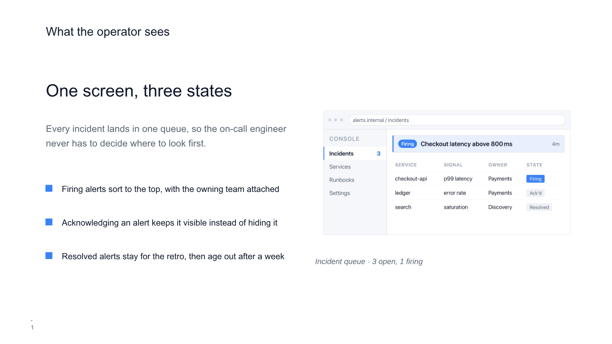
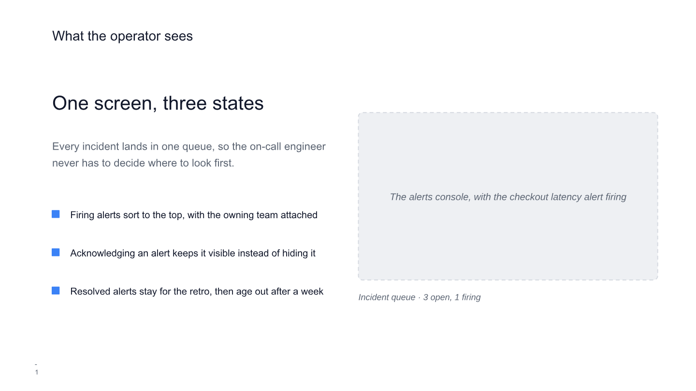

# Figure instructions

A **figure** is an HTML file you write. At build time the engine renders it with
headless Chrome and places the resulting PNG on the slide.

Read this before writing any figure markup. `custom-template-instructions.md`
covers slide layout in inches; this covers the figure itself, in pixels.

## When a figure is the right answer

A figure is **not editable in Google Slides**. That is its whole cost, and it is
why the bar is high. Use one only for content that has no native form at all:

- **Product and app UI** — a dashboard, a console, a form, a chat thread, a code
  editor, a device frame.
- **Charts** — bars, lines, scatter, anything with axes and real data.
- **Rendered text artifacts** — an email, a document page, a terminal session
  with colour.
- **Complex illustrative art** — gradients, layered or organic shapes.

Still native, always: box-and-arrow diagrams, icons, cards, and timelines. Apply
the parts test from `custom-template-instructions.md` — name the five things a
viewer would want to click and change; if you can name them, build it natively.

> For a simple labelled bar chart, native shapes are often better: the client
> edits the numbers before forwarding the deck. Reach for a figure when the chart
> has a continuous axis, many series, or hundreds of marks — where the parts are
> not things anyone would edit by hand.

Limits that keep a deck readable:

- **One figure per slide**, and figures on **no more than one slide in five**.
- **Never put the slide's title or its main message inside a figure.** That text
  must be real text on the slide: searchable, translatable, readable by a screen
  reader, and rendered with the deck's embedded fonts. A figure bakes in whatever
  font the build machine had.
- The slide must still make its point if the figure is replaced by its caption —
  which is exactly what a reader sees on a machine with no browser installed.

## The design tokens you have

The engine injects every colour in `src/design.ts` as a CSS custom property, plus
the three font stacks. Use these and a rebrand carries your figure with it:

| Token | CSS variable |
| --- | --- |
| `C.ink` | `var(--ink)` |
| `C.accent` | `var(--accent)` |
| `C.accent2` / `C.accent3` | `var(--accent-2)` / `var(--accent-3)` |
| `C.white` | `var(--white)` |
| `C.surface` | `var(--surface)` |
| `C.muted` | `var(--muted)` |
| `C.faint` | `var(--faint)` |
| `C.grey10` / `C.grey30` / `C.grey80` | `var(--grey-10)` / `var(--grey-30)` / `var(--grey-80)` |
| `C.accentSoft` | `var(--accent-soft)` |
| `FONTS.sans` / `serif` / `mono` | `var(--font-sans)` / `var(--font-serif)` / `var(--font-mono)` |

The list is generated from `C` and `FONTS`, so a token added there is available
in figures with no further work. The engine also resets margins, sets
`box-sizing: border-box`, pins `html { font-size: 16px }`, and sizes `html, body`
to exactly the viewport. Write the figure's own markup and styles; do not add
`<!doctype>`, `<html>`, or `<body>` unless you want to control the whole
document.

## The ten rules

1. **Colour comes only from the variables.** No literal hex, no `rgb()`, no named
   colours. A hardcoded colour is an off-brand colour that will not follow a
   rebrand. Neutral alphas (`rgba(0,0,0,.04)`) for a hairline are the exception.
2. **Match the slide's background.** On a light slide the figure's background is
   `var(--white)`; on a dark slide, `var(--ink)`. Never invent a third background
   tone, and do not leave it transparent unless you set `transparent: true`.
3. **Type comes only from the three families.** `var(--font-sans)` for almost
   everything, `var(--font-mono)` for code and terminals, `var(--font-serif)`
   only for a pull-quote. No `@import`, no web font links — the renderer has no
   network and the request will simply fail.
4. **Size type for the reduction.** A figure drawn 1280px wide and placed 4.5in
   wide is reduced about 3.5x, so 14px in the figure reads as roughly 4pt on the
   slide. Keep the smallest text at **18px or larger at a 1280px viewport**, and
   scale that threshold with the viewport. If a label cannot survive that, it does
   not belong in the figure.
5. **Borders are 1px `var(--grey-30)`.** Radii are 0, 4px, or 8px — nothing else,
   except a deliberate pill (`999px`).
6. **No drop shadows, no glows, no gradients**, unless the subject genuinely is
   one (illustrative art). The deck is flat; a figure with a `box-shadow` reads as
   pasted in from another document. Use a 1px border where you would have used a
   shadow.
7. **No external resources.** No ``, no remote CSS, no icon CDNs.
   Everything is inline in the one file: inline `<style>`, inline `<svg>`, and
   `data:` URIs if you truly need an image. Name resolution is blocked during the
   render, so anything remote fails silently.
8. **No JavaScript the picture depends on.** The page is captured shortly after
   load; anything animated, deferred, or hydrated may or may not be there. Write
   the final state directly in HTML.
9. **Match the viewport to the slide box.** A 4.5 x 2.81in box is 1.6:1, so
   1280x800 is right and 1280x720 is not — the engine shrinks a mismatched figure
   to fit and leaves a gap, and says so in the build report. Or pass
   `viewport: "box"` and let the engine size it for you.
10. **Real text stays on the slide.** A figure carries labels belonging to the
    thing it depicts (a button, a column header). It never carries the slide's
    title, its takeaway, or a sentence the audience is meant to read.

## Writing one

Put the HTML in the deck project's `figures/` folder — it is source, and it is
what you edit to iterate. The engine writes a copy plus the PNG to
`output/figures/`, so handing someone the output folder gives them the deck and
everything that produced the pictures in it.

```text
<projects>/<deck-id>/
  figures/alerts-console.html      <- source, committed
  output/figures/
    alerts-console.html            <- generated copy
    alerts-console.<hash>.png      <- the rendered picture
```

On a custom slide:

```ts
const CONSOLE: Figure = {
  id: "alerts-console",
  htmlFile: "figures/alerts-console.html",
  caption: "The alerts console, with the checkout latency alert firing",
  viewport: { width: 1000, height: 560 }
};

await helpers.addFigure(slide, CONSOLE, { x: 5.15, y: 1.62, w: 4.3, h: 2.408 });
```

On a cloned template slide:

```ts
overrides: [
  { op: "addFigure", id: "alerts-console", figure: CONSOLE, x: 5.15, y: 1.62, w: 4.3, h: 2.408 }
]
```

To fill a picture box the template already has, use `replaceFigure` and read that
field's `w` and `h` from the template's `fields.yml` first, then pick a viewport
with the same ratio — the figure then lands exactly:

```ts
overrides: [{ op: "replaceFigure", target: "product-screenshot", figure: CONSOLE }]
```

`caption` is required, and it is not decoration: it is the text a reader sees in
the figure's place when it cannot be rendered. Write it as a sentence about what
the figure shows, not a label. If you also caption the figure on the slide, say
something the figure does not, rather than repeating it.

Small inline figures can pass `html` instead of `htmlFile`.

## Fields

| Field | Default | Notes |
| --- | --- | --- |
| `id` | required | Names the files. Two figures must not share one. |
| `caption` | required | Stand-in text if the figure cannot render. |
| `html` / `htmlFile` | one required | Inline markup, or a path relative to the deck project. |
| `viewport` | `1280x720` | `{ width, height }` in CSS px, or `"box"` to derive it. |
| `scale` | `2` | Device pixel ratio. 2 is ~256 ppi on a full-width box. |
| `transparent` | `false` | Render on a transparent background. |
| `css` | — | Extra CSS appended after the brand block. |

## Before you build

- [ ] Every colour is a `var(--…)`
- [ ] Background matches the slide it sits on
- [ ] Only `--font-sans` / `--font-mono` / `--font-serif`
- [ ] Smallest text at least 18px at a 1280px viewport
- [ ] Borders 1px `--grey-30`; radii 0/4/8px
- [ ] No shadows, no gradients, no external resources, no load-bearing JS
- [ ] Viewport ratio equals the slide box ratio
- [ ] The slide still makes its point if the figure is replaced by its caption

## Requirements and failure

Figures need Google Chrome (or Chromium, Edge, or Brave) installed; set
`CHROME_PATH` to name a specific binary. Run `npm run install-fonts` first, or
the figure renders in a substitute font and will visibly not match the deck — the
build warns when the brand font is missing.

Without a browser the deck still builds: each figure becomes a dashed grey box
with its caption, the report says which ones and why, and the generated HTML is
written anyway so you can open it in a browser and see what it would have been. A
missing `htmlFile`, by contrast, is a hard failure — that one is yours to fix.

Rendering takes about two seconds per figure. The PNG is named by a hash of the
finished HTML, so unchanged figures are reused on the next build and editing
`src/design.ts` re-renders all of them.

A worked example lives in `examples/workspace/projects/figure-mockup/`. Its two states, rendered and
with no browser installed:

| Rendered | No browser |
|---|---|
|  |  |
